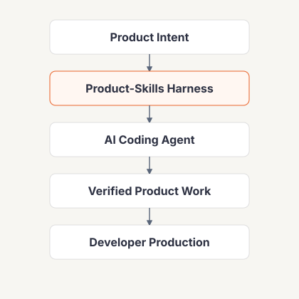
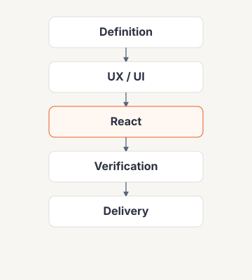
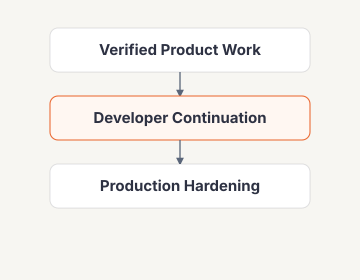

# Product-Skills

> **Product-Skills is a lightweight AI coding harness for Product Managers and Business Analysts to turn business ideas into deployable React experiences while preserving a codebase developers can continue toward production.**

Product-Skills adds just enough **product definition, UX/UI guidance, engineering conventions, context discipline, tools, and verification** around an AI coding agent.

It is **runtime-agnostic**. Any capable coding agent can use the repository conventions. Claude Code, OpenAI Codex, and Cursor currently have project configuration committed in this repo; ChatGPT can use repository context and connected tools. More runtimes can be added without changing the canonical skills.

The goal is simple: **describe a business workflow, get a credible React experience online quickly, then keep building from the same repository.**

## 🧭 System overview

<p align="center">
  
</p>

The diagram intentionally shows only the architecture flow. Details stay in text so the visual remains readable on desktop and mobile.

- **PM / BA** provides business intent.
- **Product-Skills** guides the coding agent with skills, context, memory, guardrails, tools, and verification.
- **React + TypeScript + Vite** is the default greenfield frontend target.
- **Feature-Sliced Design (FSD) v2.1** is the mandatory greenfield frontend architecture.
- **Vercel** provides the shareable preview and deployment feedback loop.
- **Supabase is optional** and only enters when a real backend improves the experience.

## 🎯 What it solves

### 🧭 Keep product intent visible
Goal, actors, business rules, and the acceptance path stay explicit so the agent does not silently invent important behavior.

### 🎨 Improve UX/UI output
The agent reasons about the main user journey, important states, responsive behavior, and accessibility basics instead of producing generic screens.

### 🧱 Preserve a production path
Generated React is strict-typed, lint-clean, FSD-validated, and separated from backend provider details so developers can continue the same repository.

### ✅ Verify before sharing
A successful build is not treated as proof. Architecture checks and the main user journey must actually pass.

### ⚡ Stay fast
Extra layers, review, subagents, backend infrastructure, and hardening are conditional. Straightforward work should remain straightforward.

## 🔌 Capability bootstrap

PM/BA users should **not need to understand MCP settings**.

Before implementation, the AI Coding Agent inspects the requested outcome, determines which capabilities are required, and asks for any missing connection immediately.

Examples:

- Figma/design URL in scope → request Figma/design access before coding
- GitHub push or PR required → request GitHub connection before coding
- Vercel preview required → request Vercel connection before coding
- Supabase backend required → request Supabase connection before coding

The agent requests **only capabilities required by the task**, then continues automatically after authorization. It must not tell the PM/BA to manually inspect runtime settings or pre-connect unrelated services.

## ⚡ Default flow

<p align="center">
  
</p>

**Definition → UX/UI → React → Verify → Delivery** is the happy path.

Use **Supabase only when a real backend materially improves the experience** — for persistence, authentication, storage, shared data, or server-side behavior. Repository exploration, deeper review, debugging, and hardening are activated only when they reduce real risk.

## 🧩 Six core skills

### 🧭 [`definition`](./skills/definition/)
Turns business intent into the minimum buildable definition: goal, actors, journey, rules, screens, and acceptance criteria.

### 🎨 [`ux-ui`](./skills/ux-ui/)
Defines flow, hierarchy, states, responsive behavior, and practical accessibility direction.

### ⚛️ [`react`](./skills/react/)
Builds React + TypeScript with mandatory Feature-Sliced Design boundaries, warning-free lint, and reusable UI/infrastructure where justified.

### 🗄️ [`supabase`](./skills/supabase/)
Optional backend accelerator. The agent can create auth/data/storage/server behavior while keeping migrations, RLS, types, API contracts, and provider infrastructure reusable by developers later.

### ✅ [`verify`](./skills/verify/)
Runs deterministic checks — including FSD architecture validation — and proves the primary user journey in the running application.

### 🚀 [`delivery`](./skills/delivery/)
Publishes a verified preview to Vercel and later raises the same repository to developer-ready quality.

Skills are intentionally broad: **split by independent reuse, not conceptual purity.**

## 🧹 Engineering baseline

For a **greenfield React project**, Product-Skills requires:

- **TypeScript strict mode**;
- **ESLint with zero warnings**;
- **Feature-Sliced Design v2.1**;
- **Steiger architecture validation**;
- deterministic scripts for **typecheck**, **lint**, **architecture**, and **build**;
- no blanket disables, unsafe `any`, or casts merely to make gates pass;
- proportionate tests as business behavior hardens.

For an **existing repository**, preserve its established architecture and quality conventions unless FSD migration is explicitly requested or needed for safe delivery.

## 🧱 Mandatory Feature-Sliced Design

Product-Skills follows the FSD v2.1 principle: **start simple, extract when needed**. The referenced [Feature-Sliced Design skill](https://www.skills.sh/feature-sliced/skills/feature-sliced-design) recommends beginning with minimal layers and extracting only for real current reuse.

A greenfield interface starts with:

```text
src/
├── app/       # providers, routing, initialization
├── pages/     # route-level composition + single-use product logic
└── shared/    # reusable infrastructure only
    ├── api/
    ├── auth/
    ├── config/
    ├── lib/
    └── ui/
```

Add only when current reuse justifies them:

```text
features/     # reusable user interactions used by multiple pages
entities/     # reusable domain models used by multiple consumers
widgets/      # discouraged; not a default layer
```

Rules:

- imports flow downward only: **app → pages → widgets → features → entities → shared**;
- page/feature/entity slices expose a public `index.ts`;
- other slices must not bypass those public APIs;
- no direct same-layer slice cross-imports;
- keep business logic out of `shared/`;
- generic API/CRUD transport → `shared/api`;
- auth/session infrastructure → `shared/auth`;
- reusable UI primitives → `shared/ui`;
- single-use product behavior stays in its page until real reuse justifies extraction;
- `processes/` is deprecated and must not be introduced.

Architecture is a deterministic quality gate, normally:

```text
steiger src
```

## 🛠 Tools & MCP

**Rule: local deterministic tools first; remote MCP/tool connections are selected from the requested outcome during capability bootstrap.**

- 📁 **Filesystem / shell** — native coding-agent tools
- 🌿 **Git** — local diff, status, commit, history
- 📦 **Package manager** — respect the existing project; for greenfield prefer `pnpm`, while `npm` and `yarn` remain supported
- 🧪 **Project checks** — typecheck, warning-free lint, FSD architecture, test, build
- 🌐 **Browser verification** — Playwright CLI when available
- 🧱 **Steiger** — FSD architecture validation
- 🗃️ **Supabase CLI** — reproducible migrations and local/backend workflows
- 🐙 **GitHub MCP** — repository, PR, issue, and remote state
- ▲ **Vercel MCP** — projects, deployments, preview state, and logs
- 🟢 **Supabase MCP** — optional backend context/actions; keep durable backend artifacts in source control

Project-scoped MCP configuration is committed for runtimes that support repository-local MCP config:

- **Claude Code:** [`.mcp.json`](./.mcp.json)
- **OpenAI Codex:** [`.codex/config.toml`](./.codex/config.toml)
- **Cursor:** [`.cursor/mcp.json`](./.cursor/mcp.json)

Other coding agents can use the same canonical skills and rules through their own native tool/MCP mechanism. Runtime support is additive, not exclusive.

Authentication uses OAuth where supported. **Tokens and privileged credentials must never be committed.**

See [`docs/TOOLS-AND-MCP.md`](./docs/TOOLS-AND-MCP.md).

## 🧱 Code developers can continue

<p align="center">
  
</p>

The production seam now follows FSD placement instead of assuming every backend call belongs in a feature folder.

For a simple screen:

**Page UI/model → shared API/auth infrastructure → Provider**

When the same interaction is genuinely reused across pages, extract it to `features/`. When a stable domain model is genuinely reused, extract it to `entities/`.

The provider may start as mock data, use Supabase, or later move to a dedicated backend without rewriting route-level UI.

When Supabase is used, the repository preserves:

- migrations / SQL
- RLS policies and auth assumptions
- safe seed/demo application data where useful
- generated or handwritten database types
- API/data contracts
- server-side functions/logic when used
- environment requirements

This lets a developer team keep Supabase, harden it, or migrate backend infrastructure while retaining frontend composition and business/data knowledge.

## 📦 Package manager policy

Product-Skills does not lock generated projects to one package manager.

1. **Existing repository:** use the package manager already selected by lockfile or `packageManager` metadata.
2. **Greenfield:** prefer **pnpm**.
3. **Compatibility:** npm and yarn remain valid; scripts and harness checks must not hard-code one manager.

Typical lockfile detection:

- `pnpm-lock.yaml` → pnpm
- `yarn.lock` → yarn
- `package-lock.json` / `npm-shrinkwrap.json` → npm

## 🎨 UX/UI baseline

Before implementation, make the **primary journey** clear and identify states that materially affect it: loading, empty, validation, error, success, permissions, and confirmation when needed.

For a greenfield business interface, the default visual stack is:

**React · TypeScript · Vite · Tailwind CSS · shadcn/ui · FSD v2.1**

Use the existing stack and design language when working inside an established repository.

Responsive smoke targets: **375 · 768 · 1024 · 1440**.

## 🧠 How the harness stays fast

The harness is the repository behavior as a whole — **instructions, skills, context, memory, tools, guardrails, verification, and conditional subagents**. It is not a `harness/` directory.

### Small context
A normal task gets only what it needs: `AGENTS.md`, current product/UI notes, verified project facts, the relevant skill, and relevant source files.

### Small memory
- `memory/PROJECT.md` — verified project facts and conventions
- `memory/DECISIONS.md` — durable technical/product decisions
- `memory/LESSONS.md` — verified mistakes worth preventing again

Memory is not a transcript archive.

### Conditional subagents
- 🔎 **explorer** — unfamiliar repository or pattern search
- 👀 **reviewer** — large, risky, or cross-feature change
- ✅ **verifier** — independent proof of the main acceptance journey
- 🛠️ **debugger** — observed failure with an unclear root cause

Small greenfield work should not become a multi-agent ceremony.

### One execution loop
**Implement → verify → continue when it passes; diagnose, fix, and verify again when it fails.**

## ✅ Quality path

### `PREVIEW_READY`
Ready for stakeholder feedback when the primary journey works, `typecheck`, warning-free `lint`, FSD `architecture`, and `build` pass, the interface is usable on desktop/mobile, the preview is reachable, and the acceptance path has been exercised.

### `DEV_READY`
The same repository reaches a higher engineering bar: stable FSD boundaries, strict TypeScript/lint discipline, proportionate tests, reproducible backend/data setup, accurate environment documentation, and visible known debt.

### Production
The frontend, SQL/migrations, API/data contracts, and server-side logic created during the fast delivery phase become developer-owned assets. Infrastructure can evolve without discarding useful work.

## 🚀 Try it

Give a coding agent a **business request**, not an implementation blueprint:

> Build a purchase-request interface. Employees create and submit requests. Managers review, approve, or reject them. Start with the shortest credible workflow. Use a backend only if it improves the experience, then deploy a shareable preview to Vercel.

The agent should resolve required tool connections first, ask only about business ambiguity that materially changes behavior, then move to implementation quickly while following the FSD contract automatically.

## 🤖 Coding-agent compatibility

Product-Skills is not limited to named vendors. A runtime can use it when it can read repository instructions/skills, edit files, run project commands, and access the tools required for the task.

**Preconfigured today:** Claude Code, OpenAI Codex, Cursor.  
**Also usable:** ChatGPT with repository context/connectors, and other compatible coding agents through their native project/tool configuration.

See [`docs/RUNTIME-COMPATIBILITY.md`](./docs/RUNTIME-COMPATIBILITY.md).

## 🗂 Repository map

- `README.md` — human entry point
- `AGENTS.md` — shared coding-agent map and invariants
- `skills/` — canonical reusable capabilities
- `workflows/` — short execution recipes
- `subagents/` — optional isolated role contracts
- `memory/` — small durable project context
- `rules/` — engineering, security, and delivery invariants
- `hooks/` — deterministic safety and ship checks
- `scripts/` — validation/setup utilities
- `templates/` — React starter contract
- `.mcp.json` — Claude Code project MCP servers
- `.codex/config.toml` — Codex MCP/project configuration
- `.cursor/mcp.json` — Cursor MCP configuration
- `docs/` — deeper architecture, runtime, and tool documentation

`skills/` is the canonical skill source. Runtime-specific configuration must not become duplicated skill libraries.

## 📚 Deeper docs

- [`docs/HARNESS-ENGINEERING.md`](./docs/HARNESS-ENGINEERING.md) — model vs harness, context, memory, subagents, verification
- [`docs/TOOLS-AND-MCP.md`](./docs/TOOLS-AND-MCP.md) — capability bootstrap, GitHub/Vercel/Supabase MCP, OAuth, approvals, local-tool policy
- [`docs/RUNTIME-COMPATIBILITY.md`](./docs/RUNTIME-COMPATIBILITY.md) — runtime compatibility and preconfigured integrations
- [Feature-Sliced Design v2.1 skill](https://www.skills.sh/feature-sliced/skills/feature-sliced-design) — frontend architecture reference

## Principles

- **Speed is a feature.** Harness mechanisms must earn their latency.
- **Runtime-agnostic core, runtime-specific configuration.**
- **The coding agent owns capability setup for non-technical users.**
- **Required MCP/tools are resolved before implementation.**
- **Feature-Sliced Design v2.1 is mandatory for greenfield React.**
- **Start simple, extract when needed.** FSD must not become folder ceremony.
- **TypeScript + ESLint + Steiger are the greenfield code-quality baseline.**
- **Respect the project's package manager; prefer pnpm for greenfield.**
- **Local tools first; MCP for remote state/actions.**
- **Backend tooling must leave reusable artifacts in source control.**
- **Verified evidence beats agent confidence.**
- **Keep context small.** More context is not automatically better context.
- **Do not abstract before the problem requires it.**
- **The same repository should have a credible path from first preview to production.**

## License

MIT
