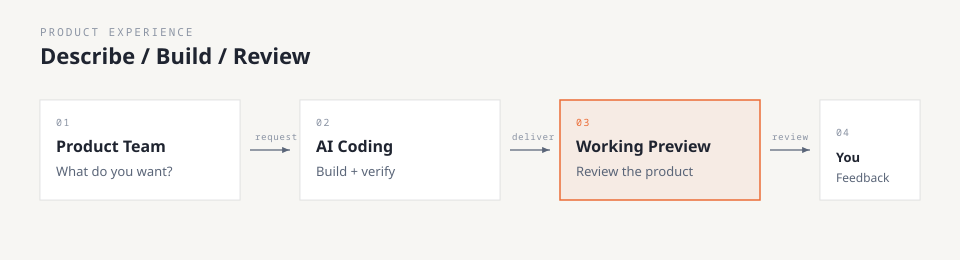
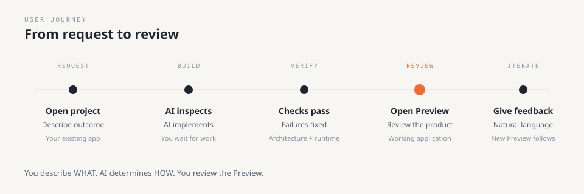
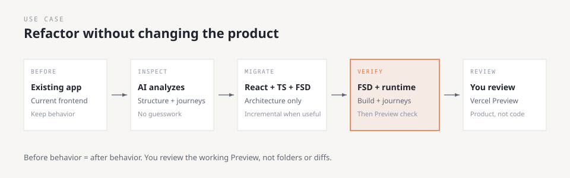
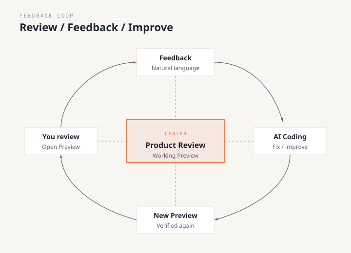
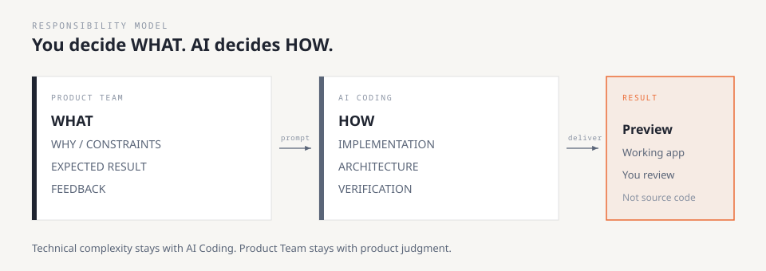

# Product-Skills

Turn Product Team requests into verified working changes with AI Coding.

> YOU DESCRIBE WHAT.  
> AI CODING HANDLES HOW.  
> YOU REVIEW THE WORKING RESULT.



**Who is this for?** Product Team.

**What is it?** A Cursor Plugin that helps AI Coding analyze your existing project, implement the change you asked for, verify it, and prepare a Preview when supported.

You do **not** need to understand skills, agents, hooks, manifests, or repository internals.

---

## Start here

### 1. Install Product-Skills in Cursor

Primary path: install the **product-skills** plugin from the **Cursor Marketplace**.

**Status:** Ready for Cursor Marketplace submission.  
This repository is **not** claiming Marketplace publication until Cursor approves and lists it.

> Until Cursor publishes the listing, maintainers may load the plugin locally for testing (see Advanced).

### 2. Open your existing project

Open the application you want to change — not this repository.

### 3. Tell AI Coding what you want

Use natural language. Example:

> Refactor this existing project to React + TypeScript + Feature-Sliced Design.  
> Do not change product behavior.  
> Verify everything and deploy a Vercel Preview for review.

Or run the Cursor command **react-fsd-refactor**.

### 4. Review the working result

Primary review surface: the **Vercel Preview** (when the project is configured and access exists).

If Preview cannot be created, AI must explain the blocker and still complete local verification that is possible.

---

## How it works



You describe **WHAT**.  
AI determines **HOW**.

---

## Example: React + TypeScript + FSD migration

You have an **existing** application.  
You want better frontend architecture **without redesigning the product**.



### Copy this prompt

```text
Refactor this existing project to React + TypeScript +
Feature-Sliced Design (FSD).

This is an architecture refactoring only.

Preserve:

- existing product behavior
- business rules
- user workflows
- permissions
- API behavior
- data behavior
- existing UX

Do not:

- add new features
- remove existing features
- redesign the product
- change business behavior
- rewrite unrelated code

First inspect the existing project.

Determine the appropriate FSD boundaries from the actual
project.

Implement the migration.

Verify:

- FSD architecture
- typecheck
- lint
- tests when available
- production build
- important runtime journeys

Fix all verification failures.

If Vercel Preview is supported and access exists,
deploy and verify it.

Return:

- summary of changes
- verification status
- Preview URL
```

---

## Review the result



### Check

| Question |
| --- |
| Does the requested change work? |
| Does the existing workflow still work? |
| Is anything missing? |
| Did anything unexpected change? |
| Is the user experience correct? |

You do **not** need to inspect source code, Git diffs, FSD folders, skills, or AI configuration.

### About Vercel

If the project is configured for Vercel and the AI Coding environment has the required access, AI can deploy and verify a Preview.

Product-Skills does **not** always deploy to Vercel. If deployment cannot run, AI must report the blocker — not invent a URL.

---

## More prompts

### Add a feature

```text
I want to add this feature:

[describe feature]

Users: [users]
Goal: [goal]

Keep existing behavior unless I explicitly change it.
Analyze first. Implement. Verify. Provide a Preview when supported.
```

### Fix a bug

```text
There is a problem:

[describe problem]

Expected: [expected]
Actual: [actual]

Investigate first. Make the smallest safe fix. Verify. Provide a Preview when supported.
```

### Improve UX

```text
I want to improve this user experience.

Current user problem: [problem]
Goal: [goal]

Keep unrelated business behavior unchanged.
Review the current flow first. Implement. Verify. Provide a Preview when supported.
```

---

## What Product Team provides



| Product Team | AI Coding |
| --- | --- |
| What you want | Project analysis |
| Why you want it | Technical approach |
| What must not change | Implementation |
| Expected result | Verification |
| Feedback | Fixes + new Preview |

---

## FAQ

**What project do I open?**  
Your existing application.

**Do I need to learn skills or agents?**  
No.

**Can I ask for React + TypeScript + FSD?**  
Yes. Use the example above or the **react-fsd-refactor** command.

**Where do I review?**  
The working Preview / Staging application.

**Does Product-Skills require Vercel, GitHub, or Supabase?**  
No. Those are optional when a specific task needs them.

---

<details>
<summary>Advanced — plugin maintainers / Marketplace testing</summary>

Not for Product Team daily use.

### Local Cursor Plugin test (required before submission)

Official docs: [Test plugins locally](https://cursor.com/docs/plugins#test-plugins-locally)

**Windows path**

```text
%USERPROFILE%\.cursor\plugins\local\product-skills\
```

**Steps**

1. From this repository run:

```text
npm run install:local-plugin
```

   Or manually copy the repo to `%USERPROFILE%\.cursor\plugins\local\product-skills\`
   (plugin root must contain `.cursor-plugin/plugin.json`).
2. In Cursor: enable **Include third-party Plugins, Skills, and other configs** if present.
3. Run **Developer: Reload Window**.
4. Open **Settings → Plugins** (or Customize → Plugins).
5. Confirm plugin name: **product-skills**.
6. Confirm components load:
   - skills (core Product / Delivery / Quality)
   - rules
   - agents (`debugger`, `explorer`, `reviewer`, `verifier`)
   - commands (`product-request`, `react-fsd-refactor`)
7. Open any app project and try the command **react-fsd-refactor** (or paste the README FSD prompt).

If the plugin does not appear: confirm the path is `plugins\local\` (not `plugins\cache\local\`), then Reload Window again.

### Maintainer validation

```text
npm run validate
```

### Optional project bootstrap scripts

`install/` helpers copy guidance into another repository for non-Marketplace workflows. They are **maintainer utilities**, not the Product Team install path.

- `node install/bootstrap.mjs --target <project>`
- `node install/install.mjs --target <project>`

Official source: `https://github.com/irwebtools/Product-Skills`

See `SECURITY.md` and `install/README.md`.

</details>

---

## License

MIT
